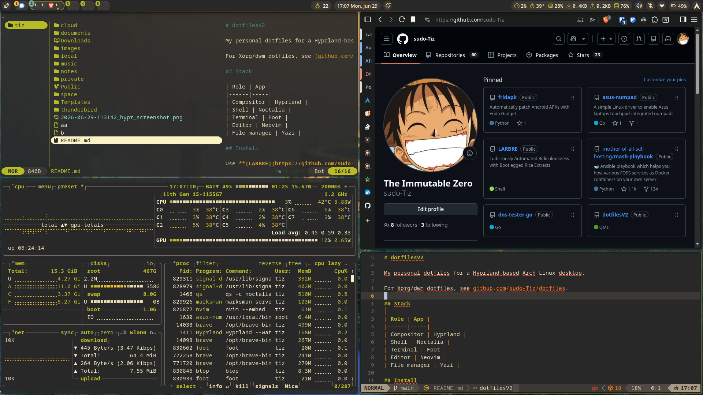

# LARBRE - Arch Linux Auto Setup

Automated post-installation script for Arch Linux that installs and configures a complete Hyprland desktop environment.

 

## Quick Start

1. **Install Arch Linux** (follow [install guide](install_arch.md))
2. **Run the script as root:**

   ```bash
   curl -LO https://raw.githubusercontent.com/sudo-Tiz/LARBRE/main/larbre.sh
   sh larbre.sh
   ```

3. **Done!** Your system is ready to use.

## What it does

- Creates a new user account
- Installs packages (desktop environment, applications, development tools)
- Deploys my personal [dotfiles](https://github.com/sudo-Tiz/dotfilesV2)
- Configures battery monitoring for laptops
- Sets up secure DNS and network privacy
- Sets up Minecraft theme for GRUB and Plymouth

## Stack

| Role | App |
|------|-----|
| Compositor | Hyprland |
| Shell | Noctalia |
| Terminal | Foot |
| Editor | Neovim |
| File manager | Yazi |


Full package list in [essential-progs.csv](essential-progs.csv) and [additional-progs.csv](additional-progs.csv).

## Requirements

- Fresh Arch Linux installation
- Internet connection
- Run as root

## Customization

Edit these variables at the top of `larbre.sh`:

- `dotfilesrepo`: Your dotfiles repository
- `progsfiles`: Newline-separated list of CSV URLs or local paths

To add an extra package list (e.g. `foo.csv`) before running:

```sh
progsfiles="$progsfiles
https://example.com/foo.csv"
sh larbre.sh
```

## CSV Format

```
TAG,PACKAGE,DESCRIPTION
,firefox,"is a web browser"
A,yay,"is an AUR helper"
G,https://github.com/user/repo.git,"is a git program"
```

- Empty TAG = official repo
- `A` = AUR
- `G` = Git repository (make install)

## Other Versions

- **Xorg branch:** [xorg branch](https://github.com/sudo-Tiz/LARBRE/tree/Xorg) (unmaintained)

## Credits

Based on [LARBS](https://github.com/LukeSmithxyz/LARBS) by Luke Smith.
